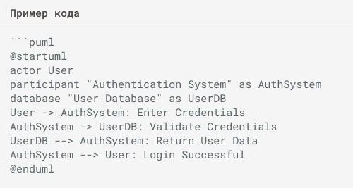
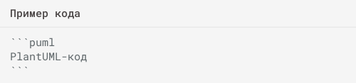
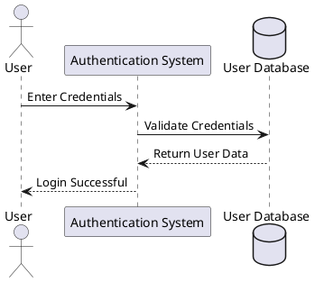

# первый шаг

Проверка хлебных крошек





````title="Пример кода"

````

````title="Пример кода"
```puml
PlantUML-код
```
````

stoplight

readme

redocly

Генерация спецификации из кода

Flask

Flasgger