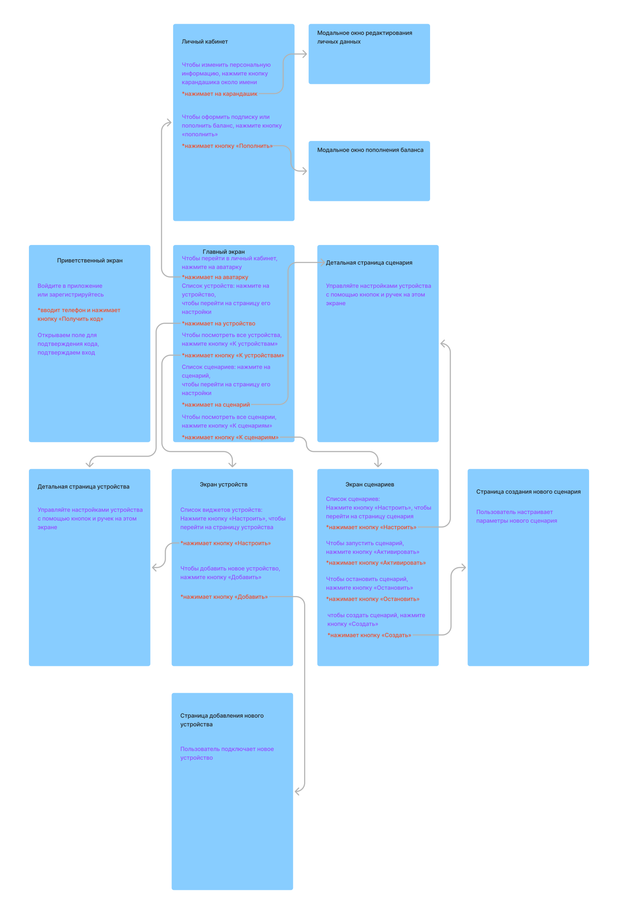

# Самый умный дом

!!! quote ""
    Разработал Parawriter

«Самый умный дом» — еще одна система для организации умного дома. С помощью приложения можно управлять умными устройствами, создавать сценарии для решения разных бытовых задач.

## Этапы работы

Передо мной стояла задача разработать концепцию еще одного приложения Умного дома, которое сможет составить конкуренцию на рынке других умных систем.

Для решения этой задачи я провел discovery-исследования, исследовал продукты конкурентов, определил необходимые метрики, написал storyframes, разработал интерфейсные тексты и макеты для мобильной и десктоп-версий, провел юзабилити-исследования для корректировки макетов.

## Метрики

Я выделил две ключевые метрики:

- Конверсия триалов в оплату. Система Умного дома работает по модели, подразумевающей наличие триального доступа к продукту. Для бизнеса очень важно следить за количеством пользователей, перешедших от пробной бесплатной версии приложения к оплаченной подписке.
- DAU. Важно отслеживать ежедневную активность пользователей в приложении — это поможет оценить степень погруженности пользователей в систему Умного дома и вероятность того, что они продлят подписку в следующем месяце.

## Job stories

Для проведения discovery-исследования и проектирования job stories я подготовил опрос, в котором приняли участие 7 респондентов, уже имеющих опыт работы с системами умного дома или отдельными умными системами.

**Вопросы анкеты**

1. Какие проблемы вы хотите решить с помощью системы Умного дома?
2. Что вам мешает при управлении умными устройствами в других приложениях Умного дома?
3. Какие умные устройства вы считаете лишними в Умном доме и почему?
4. Какие умные устройства вы хотели бы приобрести и зачем?

На основе полученных ответов я написал  job stories:

|Ситуация (контекст и проблема) |Мотивация (изменение) |Результат (в эмоц.ключе) |Комментарий |
|:------------------------------|:---------------------|:------------------------|:-----------|
|Когда я возвращаюсь вечером домой, мне приходится пылесосить пол и проводить влажную уборку, так как моя собака очень сильно линяет |Я хочу возвращаться в чистую квартиру |Чтобы я смог отдохнуть и заняться своими личными делами, а не тратить время на приборку |Можно добавить автоматические сценарии для отдельных умных устройств |
|Когда я ухожу из дома, я начинаю переживать, выключила ли я газ, перекрыла ли воду и отключила ли утюг |Я хочу иметь возможность проверять себя уже после того, как вышла из дома |Чтобы я перестала переживать, что что-то забыла, и не думать об этом вне дома |Можно добавить виджеты устройств на главном экране, на которых будет отображаться их текущее состояние. Например: у розеток будет отображаться, выключены или включены они, у датчиков будет отображаться их текущий статус |
|Когда я ложусь спать, мне лень подниматься и идти к выключателям, чтобы отключить свет в квартире |Я хочу выключать освещение, не вставая с кровати |Чтобы я мог спокойно засыпать в кровати, не вставая перед сном |Можно добавить возможность активировать ручные сценарии по нажатию одной кнопки в приложении: например, объединить все лампочки в доме в один ручной сценарий и вывести кнопку его активации на главный экран, чтобы выключать свет во всем доме одним нажатием |
|Когда я просыпаюсь утром, мне приходится вставать, греть чайник и жарить тост, чтобы позавтракать |Я хочу просыпаться под запах свежего тоста и сразу приступать к горячему завтраку, не занимаясь его готовкой |Чтобы я был счастлив и бодр с самого утра |Добавить возможность создавать автоматические сценарии, приуроченные к определенному времени выполнения: например, по будням в 7:00 включить чайник и умный тостер |
|Когда я забываю опустить сливной шланг от стиральной машины в раковину, я заливаю соседей |Я хочу, чтобы машина отключалась, если я забыл опустить сливной шланг |Чтобы я больше не извинялся перед соседями и не оплачивал им слив воды из натяжного потолка |Добавить возможность подключения сторонних датчиков и устройств и организовывать сценарии с использованием нескольких устройств: например, сценарий, при котором срабатывает датчик протечки и активирует автоматический запорный кран на трубе или отключение умной розетки |
|Когда я ухожу из дома, моя собака начинает скучать, скулить и плакать |Я хочу общаться со своей собакой, когда я нахожусь не дома |Чтобы моя собака не чувствовала себя одинокой и не скулила на весь подъезд |Можно попробовать интегрировать какую-нибудь стороннюю систему видеонаблюдения, чтобы пользователь мог в режиме реального времени смотреть трансляцию с камер и через микрофон контактировать с домом |
|Когда я покупаю новое умное устройство, мне приходится постоянно что-то мудрить, чтобы подключить его к остальным умным устройствам |Я хочу, чтобы любое умное устройство без проблем подключалось в систему, вне зависимости от производителя |Чтобы я больше не ругался неприличными словами, пытаясь два часа настроить новое устройство |Нужно отказаться от приоритетов в использовании умных устройств определенного изготовителя и максимально упростить интеграцию любых умных устройств в нашу систему Умного дома |

## Результаты исследования. Гипотеза

4 из 7 респондентов сказали, что им важно, чтобы в приложении можно было создавать пользовательские сценарии и иметь к ним быстрый доступ для управления и активации.

Я предположил, что мы должны вынести список существующих сценариев и кнопку «Добавить сценарий» на главный экран приложения. Это может повысить ежедневную активность пользователей в приложении (DAU).

## Storyframes

На основе собранной информации я определился с основными сценариями использования приложения и собрал схему логики работы:

## Tone of voice

Перед тем, как начать работу над интерфейсными текстами приложения, я решил определиться с тональностью продукта. Как наш умный дом будет разговаривать с пользователями? Будет ли язык Самого умного дома отличаться от конкурентов?

Я проанализировал тексты двух конкурентов и отметил их позиционирование на матрице: